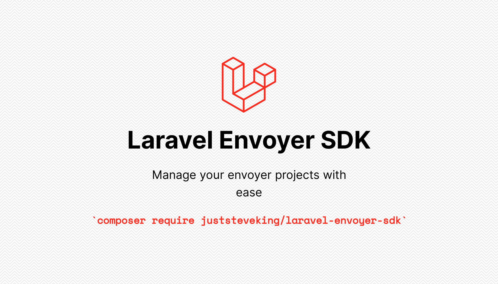

# Laravel Envoyer SDK

<p align="center">



</p>

<!-- BADGES_START -->
[![Latest Version][badge-release]][packagist]
[![PHP Version][badge-php]][php]


[![Total Downloads][badge-downloads]][downloads]

[badge-release]: https://img.shields.io/packagist/v/juststeveking/laravel-envoyer-sdk.svg?style=flat-square&label=release
[badge-php]: https://img.shields.io/packagist/php-v/juststeveking/laravel-envoyer-sdk.svg?style=flat-square
[badge-downloads]: https://img.shields.io/packagist/dt/juststeveking/laravel-envoyer-sdk.svg?style=flat-square&colorB=mediumvioletred

[packagist]: https://packagist.org/packages/juststeveking/laravel-envoyer-sdk
[php]: https://php.net
[downloads]: https://packagist.org/packages/juststeveking/laravel-envoyer-sdk
<!-- BADGES_END -->

A simple to use PHP class to work with the Laravel Envoyer API

## Requirements

- PHP ^7.4
- PHP ext-json


## Installation

The preferred method of installation is to use composer:

```bash
$ composer require juststeveking/laravel-envoyer-sdk
```

To work with this package, firstly you **must** have a [Laravel Envoyer](https://envoyer.io/) account, and secondly you must create an API token through [Laravel Envoyer](https://envoyer.io/) itself.


## Usage

You create a simple SDK like so:

```php
use JustSteveKing\Laravel\Envoyer\SDK\Envoyer;

$envoyer = Envoyer::illuminate(
    API_TOKEN_HERE,
    'https://envoyer.io/' // this is optional as is the default
);
```

Once you have `$envoyer` set up, you can now start to work with the resources through the API:

## Managing Projects

The simple way to manage envoyer projects through the SDK:

### List all Projects

```php
use JustSteveKing\Laravel\Envoyer\SDK\Envoyer;

$envoyer = Envoyer::illuminate(
    API_TOKEN_HERE,
    'https://envoyer.io/' // this is optional as is the default
);

$envoyer->projects->all();
```


### Create a new Project

```php
use JustSteveKing\Laravel\Envoyer\SDK\Envoyer;

$envoyer = Envoyer::illuminate(
    API_TOKEN_HERE,
    'https://envoyer.io/' // this is optional as is the default
);

$envoyer->projects->save([
    'name' => 'SDK test',
    'provider' => 'github', // bitbucket, github, gitlab, gitlab-self
    'type' => 'laravel-5', // laravel-5. laravel-4, other
    'repository' => 'laravel/laravel',
    'branch' => 'master'
]);
```

### Fetch a Specific Project

```php
use JustSteveKing\Laravel\Envoyer\SDK\Envoyer;

$envoyer = Envoyer::illuminate(
    API_TOKEN_HERE,
    'https://envoyer.io/' // this is optional as is the default
);

$envoyer->projects->find('id-of-project');
```


### Modify a Project

```php
use JustSteveKing\Laravel\Envoyer\SDK\Envoyer;

$envoyer = Envoyer::illuminate(
    API_TOKEN_HERE,
    'https://envoyer.io/' // this is optional as is the default
);

$envoyer->projects->modify('id-of-project', [
    'name' => 'Project name update through SDK',
]);
```

### Deleting a Project

```php
use JustSteveKing\Laravel\Envoyer\SDK\Envoyer;

$envoyer = Envoyer::illuminate(
    API_TOKEN_HERE,
    'https://envoyer.io/' // this is optional as is the default
);

$envoyer->projects->delete('id-of-project');
```


## Managing Servers

The simple way to manage envoyer servers through the SDK:

### List all Servers for a Project

```php
use JustSteveKing\Laravel\Envoyer\SDK\Envoyer;

$envoyer = Envoyer::illuminate(
    API_TOKEN_HERE,
    'https://envoyer.io/' // this is optional as is the default
);

$envoyer->servers->on('id-of-project')->all();
```


### Create a new Server for a Project

```php
use JustSteveKing\Laravel\Envoyer\SDK\Envoyer;

$envoyer = Envoyer::illuminate(
    API_TOKEN_HERE,
    'https://envoyer.io/' // this is optional as is the default
);

$envoyer->servers->on('id-of-project')->create([
    'name' => 'Server Name',
    'connectAs' => 'forge',
    'host' => 'ip-address-here',
    'phpVersion' => 'php80' // php80, php74, php73, php72, php71, php70, php56
]);
```


### Fetch a single Server for a Project

```php
use JustSteveKing\Laravel\Envoyer\SDK\Envoyer;

$envoyer = Envoyer::illuminate(
    API_TOKEN_HERE,
    'https://envoyer.io/' // this is optional as is the default
);

$envoyer->servers->on('id-of-project')->first('id-of-your-server');
```


### Modify a Server

```php
use JustSteveKing\Laravel\Envoyer\SDK\Envoyer;

$envoyer = Envoyer::illuminate(
    API_TOKEN_HERE,
    'https://envoyer.io/' // this is optional as is the default
);

$envoyer->servers->on('id-of-project')->modify('id-of-your-server', [
    'name' => 'SDK Server'
]);
```


### Delete a Server

```php
use JustSteveKing\Laravel\Envoyer\SDK\Envoyer;

$envoyer = Envoyer::illuminate(
    API_TOKEN_HERE,
    'https://envoyer.io/' // this is optional as is the default
);

$envoyer->servers->on('id-of-project')->remove('id-of-your-server');
```


## Managing Environments on a Project

The simple way to manage project environments through the SDK:


### Get current environment

```php
use JustSteveKing\Laravel\Envoyer\SDK\Envoyer;

$envoyer = Envoyer::illuminate(
    API_TOKEN_HERE,
    'https://envoyer.io/' // this is optional as is the default
);

$envoyer->environments->on('id-of-project')->key('1234')->all();
```


### Get environment servers

```php
use JustSteveKing\Laravel\Envoyer\SDK\Envoyer;

$envoyer = Envoyer::illuminate(
    API_TOKEN_HERE,
    'https://envoyer.io/' // this is optional as is the default
);

$envoyer->environments->on('id-of-project')->key('1234')->servers();
```


### Updating project environments

```php
use JustSteveKing\Laravel\Envoyer\SDK\Envoyer;

$envoyer = Envoyer::illuminate(
    API_TOKEN_HERE,
    'https://envoyer.io/' // this is optional as is the default
);

$envoyer->environments->on('id-of-project')
    ->key('1234')->onServer(1, 2, 3)
    ->put('test=api', 'another=value')
```


### Resetting environment key

```php
use JustSteveKing\Laravel\Envoyer\SDK\Envoyer;

$envoyer = Envoyer::illuminate(
    API_TOKEN_HERE,
    'https://envoyer.io/' // this is optional as is the default
);

$envoyer->environments->on('id-of-project')->key('new-env-key')->reset('new-key');
```


## Listing available actions from Envoyer

### Get all Actions

```php
use JustSteveKing\Laravel\Envoyer\SDK\Envoyer;

$envoyer = Envoyer::illuminate(
    API_TOKEN_HERE,
    'https://envoyer.io/' // this is optional as is the default
);

$envoyer->actions->all();
```


## Managing Action Hooks for a Project

The simple way to manage action hooks for a project through the SDK:

### List all Hooks

```php
use JustSteveKing\Laravel\Envoyer\SDK\Envoyer;

$envoyer = Envoyer::illuminate(
    API_TOKEN_HERE,
    'https://envoyer.io/' // this is optional as is the default
);

$envoyer->hooks->on('id-of-project')->all();
```


### Create a new Hook

```php
use JustSteveKing\Laravel\Envoyer\SDK\Envoyer;

$envoyer = Envoyer::illuminate(
    API_TOKEN_HERE,
    'https://envoyer.io/' // this is optional as is the default
);

$envoyer->hooks->on('id-of-project')->create([
    'name' => 'list',
    'script' => 'll',
    'runAs' => 'forge',
    'actionId' => 'id-of-action',
    'timing' => 'after',
    'servers' => ['id-of-server', 'another-id-of-a-server']
]);
```


### Get a single Hook

```php
use JustSteveKing\Laravel\Envoyer\SDK\Envoyer;

$envoyer = Envoyer::illuminate(
    API_TOKEN_HERE,
    'https://envoyer.io/' // this is optional as is the default
);

$envoyer->hooks->on('id-of-project')->first('id-of-hook');
```


### Updating a Hook

```php
use JustSteveKing\Laravel\Envoyer\SDK\Envoyer;

$envoyer = Envoyer::illuminate(
    API_TOKEN_HERE,
    'https://envoyer.io/' // this is optional as is the default
);

$envoyer->hooks->on('id-of-project')->modify('id-of-hook', [
    'name' => 'list files and directories'
]);
```


### Deleting a Hook

```php
use JustSteveKing\Laravel\Envoyer\SDK\Envoyer;

$envoyer = Envoyer::illuminate(
    API_TOKEN_HERE,
    'https://envoyer.io/' // this is optional as is the default
);

$envoyer->hooks->on('id-of-project')->remove('id-of-hook');
```


## Managing Deployments

The simple way to manage project deployments through the SDK:

### List all Deployments

```php
use JustSteveKing\Laravel\Envoyer\SDK\Envoyer;

$envoyer = Envoyer::illuminate(
    API_TOKEN_HERE,
    'https://envoyer.io/' // this is optional as is the default
);

$envoyer->deployments->on('id-of-project')->all();
```


### Pushing a new Deployment

```php
use JustSteveKing\Laravel\Envoyer\SDK\Envoyer;

$envoyer = Envoyer::illuminate(
    API_TOKEN_HERE,
    'https://envoyer.io/' // this is optional as is the default
);

// Default Deployment
$envoyer->deployments->on('id-of-project')->deploy();

// Deployment from branch
$envoyer->deployments->on('id-of-project')->deploy([
    'from' => 'branch',
    'branch' => 'develop'
]);

// Deployment from tag
$envoyer->deployments->on('id-of-project')->deploy([
    'from' => 'tag',
    'tag' => 'v2.0.0'
]);
```

### Getting a single Deployment

```php
use JustSteveKing\Laravel\Envoyer\SDK\Envoyer;

$envoyer = Envoyer::illuminate(
    API_TOKEN_HERE,
    'https://envoyer.io/' // this is optional as is the default
);

$envoyer->deployments->on('id-of-project')->first('id-of-deployment');
```

### Cancel a Deployment

```php
use JustSteveKing\Laravel\Envoyer\SDK\Envoyer;

$envoyer = Envoyer::illuminate(
    API_TOKEN_HERE,
    'https://envoyer.io/' // this is optional as is the default
);

$envoyer->deployments->on('id-of-project')->cancel('id-of-deployment');
```


## Managing Collaborators

The simple way to manage project collaborators through the SDK

### List all Collaborators

```php
use JustSteveKing\Laravel\Envoyer\SDK\Envoyer;

$envoyer = Envoyer::illuminate(
    API_TOKEN_HERE,
    'https://envoyer.io/' // this is optional as is the default
);

$envoyer->collaborators->on('id-of-project')->all();
```


### Invite a new Collaborator

```php
use JustSteveKing\Laravel\Envoyer\SDK\Envoyer;

$envoyer = Envoyer::illuminate(
    API_TOKEN_HERE,
    'https://envoyer.io/' // this is optional as is the default
);

$envoyer->collaborators->on('id-of-project')->invite([
    'email' => 'test@email.com'
]);
```


### Get a single Collaborator

```php
use JustSteveKing\Laravel\Envoyer\SDK\Envoyer;

$envoyer = Envoyer::illuminate(
    API_TOKEN_HERE,
    'https://envoyer.io/' // this is optional as is the default
);

$envoyer->collaborators->on('id-of-project')->first('id-of-collaborator');
```


### Remove a Collaborator

```php
use JustSteveKing\Laravel\Envoyer\SDK\Envoyer;

$envoyer = Envoyer::illuminate(
    API_TOKEN_HERE,
    'https://envoyer.io/' // this is optional as is the default
);

$envoyer->collaborators->on('id-of-project')->remove('id-of-collaborator');
```


## Managing Notifications

The simple way to manage project notifications through the SDK:

### List all Notifications

```php
use JustSteveKing\Laravel\Envoyer\SDK\Envoyer;

$envoyer = Envoyer::illuminate(
    API_TOKEN_HERE,
    'https://envoyer.io/' // this is optional as is the default
);

$envoyer->notifications->on('id-of-project')->all();
```


### Create a new Notification

```php
use JustSteveKing\Laravel\Envoyer\SDK\Envoyer;

$envoyer = Envoyer::illuminate(
    API_TOKEN_HERE,
    'https://envoyer.io/' // this is optional as is the default
);

// Create an Email Notification
$envoyer->notifications->on('id-of-project')->create([
    'name' => 'Notification Name',
    'type' => 'email', // email, discord, slack, teams
    'email_address' => 'test@email.com'
]);

// Create a Discord Notification
$envoyer->notifications->on('id-of-project')->create([
    'name' => 'Notification Name',
    'type' => 'discord', // email, discord, slack, teams
    'discord_webhook' => 'url-of-webhook'
]);

// Create a Slack Notification
$envoyer->notifications->on('id-of-project')->create([
    'name' => 'Notification Name',
    'type' => 'slack', // email, discord, slack, teams
    'slack_webhook' => 'url-of-webhook'
]);

// Create a Teams Notification
$envoyer->notifications->on('id-of-project')->create([
    'name' => 'Notification Name',
    'type' => 'teams', // email, discord, slack, teams
    'teams_webhook' => 'url-of-webhook'
]);
```


### Get a single Notification

```php
use JustSteveKing\Laravel\Envoyer\SDK\Envoyer;

$envoyer = Envoyer::illuminate(
    API_TOKEN_HERE,
    'https://envoyer.io/' // this is optional as is the default
);

$envoyer->notifications->on('id-of-project')->first('id-of-notification');
```


### Modify a Notification

```php
use JustSteveKing\Laravel\Envoyer\SDK\Envoyer;

$envoyer = Envoyer::illuminate(
    API_TOKEN_HERE,
    'https://envoyer.io/' // this is optional as is the default
);

$envoyer->notifications->on('id-of-project')->modify('id-of-notification', [
    'name' => 'Send Someone an email',
    'type' => 'email',
    'email_address' => 'test@email.com'
]);
```


### Remove a Notification

```php
use JustSteveKing\Laravel\Envoyer\SDK\Envoyer;

$envoyer = Envoyer::illuminate(
    API_TOKEN_HERE,
    'https://envoyer.io/' // this is optional as is the default
);

$envoyer->notifications->on('id-of-project')->remove('id-of-notification');
```
